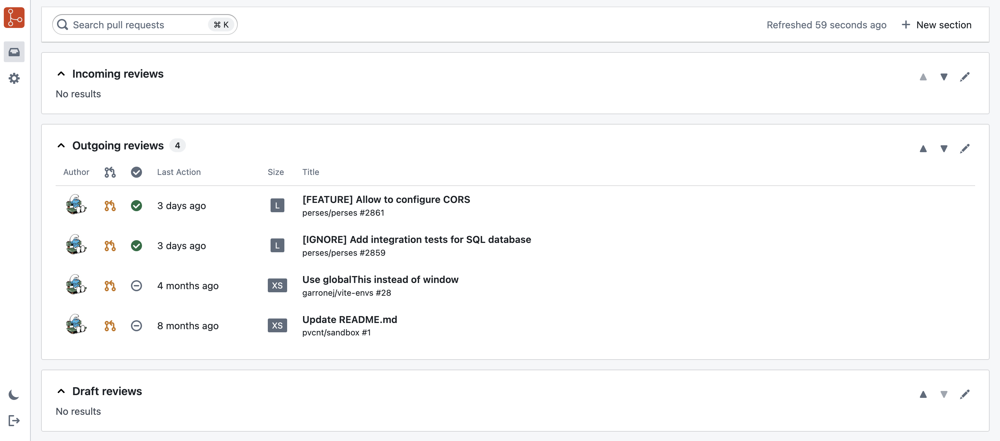

# Critic

Critic is the missing inbox for your pull requests.

## Features

- Organize pull requests into sections, defined by GitHub search queries.
- Pull requests are automatically and periodically refreshed.
- Keyboard shortcuts (e.g., cmd+k) for a fast navigation.
- Does not require a GitHub app to be installed.

# Public instance

Critic is publicly available at https://getcritic.dev/.

## License

Critic is open-source under the Apache 2.0 License.
